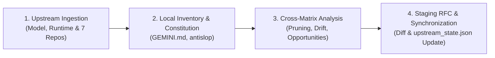

# Upstream Auditor — Model Drift, Platform & Skills Synchronization Engine

A specialized maintenance and audit skill designed to bridge the gap between upstream platform evolution (Google Gemini models & Antigravity updates), external open-source skills, and the user's local customized agent environment.

---

## 0. Core Invariant and Objective

As model capabilities advance, platforms evolve, and external open-source skills update, uncurated prompt directives and uninspected external changes introduce **scaffolding debt, context bloat, and constitutional drift**.

The mandate of this skill is to:
1. Detect changes across the active model, Antigravity runtime, and the 7 tracked community repositories.
2. Filter incoming changes through the global constitution and the `antislop` design/copy quality contract.
3. Present the user with a transparent, reviewable, and minimal synchronization diff.

---

## 1. Invocation and Parameter Hierarchy

Refine the audit scope using targeted flags:

* **Full Audit:** `/audit-upstream` or `/audit-upstream --all`
  * Audits model drift, runtime platform, and all 7 external skill repositories across a 3-tier inspection matrix.
* **External Skills Only:** `/audit-upstream --skills`
  * Audits only git commit heads in `upstream_state.json` against local installed skills.
* **Targeted Single Skill:** `/audit-upstream --skill <skill_name>`
  * Audits only the specified skill (e.g. `/audit-upstream --skill antislop`, `chisle`, `procoder`).
* **Model Only:** `/audit-upstream --model`
  * Inspects only the active LLM (Gemini Flash, Pro, etc.) and official release notes.
* **Platform Only:** `/audit-upstream --platform`
  * Audits only the Antigravity builtin environment (`builtin/skills`) and lifecycle hooks.
* **Proactive 72-Hour Watchdog:**
  * The lightweight background watcher (`upstream_watcher.py` / `check_skills.sh`) queries commit hashes when 72 hours (3 days) have elapsed since the prior audit, alerting on turn 1 if new commits are detected.

---

## 2. Four-Stage Audit Lifecycle



### Stage 1: Upstream Ingestion

1. **Model Layer (`--model` or `--all`):**
   * Identify active model name and ID (e.g. `Gemini 3.8 Flash`, `Gemini Pro`).
   * Review official release notes, model cards, and capability updates via web search (`search_web`) or URL fetching (`read_url_content`).
   * Document new default behaviors (tone, Chain-of-Thought style, tool-calling precision, context window limits).
2. **Platform Layer (`--platform` or `--all`):**
   * Inspect builtin skills and documentation under `~/.gemini/antigravity/builtin/skills/`.
   * Detect new builtin capabilities, updated lifecycle hooks, or modified runtime tools.
3. **External Community Ecosystem (`--skills`, `--skill <name>`, or `--all`):**
   * Query the 7 tracked repositories in `upstream_state.json` via GitHub API or `git ls-remote`:
     * `miqdadbadjuber/anti-slop` $\rightarrow$ `antislop` (+ code, ui, human, copywriting, layoutmobile)
     * `JayPokale/Chisle` $\rightarrow$ `chisle`
     * `Leonxlnx/unlazy` $\rightarrow$ `unlazy`
     * `azrtydxb/procoder` $\rightarrow$ `procoder`
     * `bendrape1-byte/silk-design` $\rightarrow$ `silk-design`
     * `affaan-m/everything-claude-code` $\rightarrow$ `architecture-decision-records`, `database-migrations`, `security-review`
     * `mattpocock/skills` $\rightarrow$ `grill-me` (locally `deep-grill`), `diagnosing-bugs`
   * Fetch diff between recorded `last_synced_commit` and current remote HEAD.

### Stage 2: Local Inventory

1. **Global Constitution:** `GEMINI.md` and active project instruction files.
2. **Custom Skills:** User-defined and community-curated skills in `~/.gemini/config/skills/`.
3. **Auditor Subagents & MCP:** Defined auditor personas and registered MCP tools.

### Stage 3: Cross-Matrix Analysis & Constitutional Filter

Every upstream modification undergoes constitutional verification:
* **AI-Slop & Fluff Check:** Does the update introduce verbosity or hype phrases? (Constitution Rule 3 & `antislop`).
* **Test Invariant Protection:** Does the upstream change soften verification or weaken test rigor?
* **Tier Compatibility:** Does it violate the 3-tier execution ladder?

Findings are strictly classified into three categories:

| Category | Definition | Example Action |
| :--- | :--- | :--- |
| **A. Pruning (Redundant)** | Capabilities natively handled by newer models, or upstream fluff/slop. | Eliminate redundant prompt scaffolding from local skill files. |
| **B. Friction / Drift** | Direct contradictions with the local constitution or renamed parameter contracts. | Adapt incoming instructions to adhere to local constitutional rules. |
| **C. Opportunities** | Upstream performance optimizations, sharper test gates, or improved patterns. | Integrate new techniques into local skills via minimal, targeted diffs. |

### Stage 4: Reporting and Staging

1. Present a structured **Audit Report**:
   * Summary of upstream changes detected.
   * Categorized recommendations (Pruning, Drift, Opportunities).
   * Exact reviewable `diff` blocks.
2. For multi-file updates, stage proposed changes in `~/.gemini/config/staging/<skill>-sync.md`.
3. Apply updates to local skills only upon explicit user confirmation.
4. Update target commit SHAs and timestamps in `~/.gemini/config/skills/upstream-auditor/upstream_state.json`.

---

## 3. State Ledger (`upstream_state.json`)

Following synchronization, update the local state ledger:

```json
{
  "last_audited_model": "<model_name>",
  "last_model_slug": "<model_slug>",
  "builtin_skills_hash": "<computed_sha256>",
  "last_audit_timestamp": "<ISO_8601_timestamp>",
  "last_skills_audit_timestamp": "<ISO_8601_timestamp>",
  "skills_audit_interval_hours": 72,
  "status": "synchronized",
  "tracked_repositories": {
    "anti-slop": {
      "repo": "miqdadbadjuber/anti-slop",
      "branch": "main",
      "last_synced_commit": "7437352",
      "target_skills": ["antislop", "antislop-code", "antislop-ui", "antislop-human", "antislop-copywriting", "antislop-layoutmobile"]
    }
  }
}
```

---

## 4. Safety and Discipline Invariants

* **No Automated Overwrites:** Never mutate local rules or skills without explicit user approval.
* **Protected Local Core:** `GEMINI.md`, `harness`, `audit`, and local auditor subagents cannot be modified by automated upstream syncs; they are edited solely upon direct user instructions.
* **Evidence-Based Changes:** Every proposed addition or deletion must cite the exact upstream commit or model card reference.
